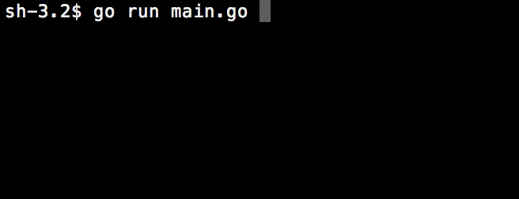

# Go-Hanoi

The famous Hanoi game written in Go. To test some configurations, from a shell:

```shell
go get github.com/skelterjohn/go.matrix
git clone https://github.com/made2591/go-hanoi
cd go-hanoi
go run main.go
```

Moves will be printed in stdout, with scores (number of) in the end. Below an execution gif with 6 disks:

<p>
	
</p>

## Dependencies

The only external used is the following:

```shell
go get github.com/skelterjohn/go.matrix
```

Thanks to [skelterjohn](https://github.com/skelterjohn/) for his lib. I think I will contribute soon because I'm truly interested (see [go-perceptron-go](https://github.com/made2591/go-perceptron-go)). I was just bored XD (this fu****ng tricky game drived me crazy), of course you can use primitive...

## Notes about pretty print

It might seem easy to make a version of Hanoi in Go. And it is. My initial plan was to learn how to print in place multiline-string in go. Then problem became "how can I pretty print a generic Hanoi configuration?", such as [2, 1, 0]. After some tests, I realized that the best Hanoi representation is the matrix form.

So I looked for a matrix lib on github and found [go.matrix](https://github.com/skelterjohn/go.matrix) to be good enought for my needs (just a easy/ready-to-use matrix representation). I think I will go throught this repository because I found some foundamentals missing (projections, max, sum, etc). Back to my problem...how could you define f([][]) to return strings like the one above? 

```shell
|--------------------------|
|   **   |        |        |  
|  ****  |        |        |  
| ****** |        |        |  
|--------------------------|

|--------------------------|
|        |        |        |  
|        |        |   **   |  
| ****** |        |  ****  |  
|--------------------------|

|--------------------------------------|
|            |            |            |  
|            |            |            |  
|            |            |            |  
|  ********  |            |     **     |  
| ********** |   ******   |    ****    |  
|--------------------------------------|
```

The answer is simple: DON'T try to collapse positions and dimensions in one-dimensional struct. Instead, procede creating a matrix form with a drawcell function as defined above. With a little of linear algebra you should understand the logic behind: the point is find relations between average point, doubling disk dimension and user mean to center disk in columns (see ```func cell```) and please feel free to ask.

## Improvements

- Realize a better-performance version of Hanoi solver if there are more than one ```auxiliary``` columns.
- Introduce check-errors for setup (actually, index of columns are not cheked)


